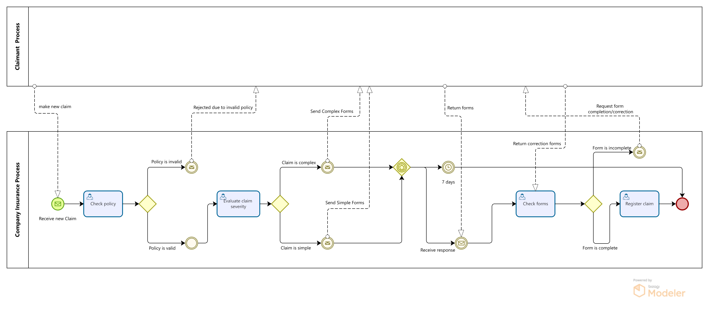
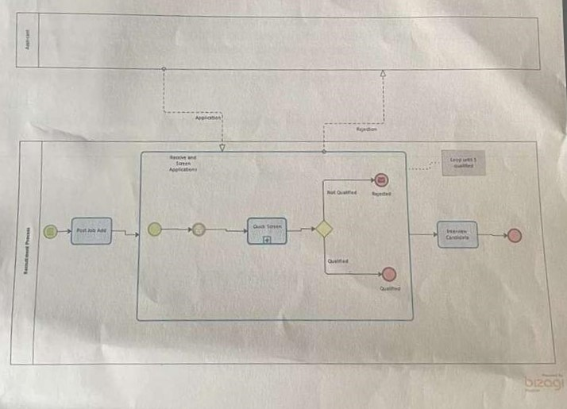
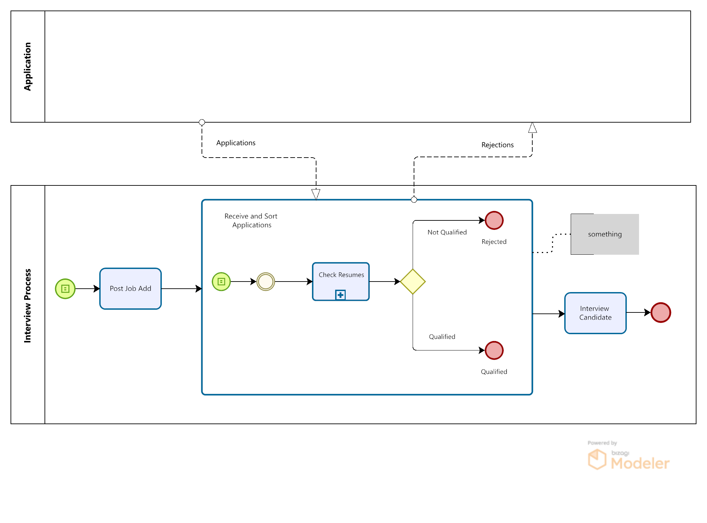

# Business Process Management Autumn Repeat 2022/2023 Paper MGMT06061

## Question 1 (33.33 Marks)

Practicing Business Process Management requires the measurement and supervision of process performance. The three main processes are;

- Primary processes,
- Support processes, and
- Management processes.

Provide your understanding for EACH of the THREE processes

### Question 1 Answer

#### 1. Primary Processes

**Understanding:**
Primary processes, also known as core processes, are those that directly create value for customers and are fundamental to the business’s mission. These processes are integral to the business's ability to produce its primary products or services and are directly linked to the company's strategic goals and objectives. Primary processes typically include the steps taken from the initial input to the final output delivered to the customer.

**Examples:**

- **Manufacturing:** In a car manufacturing company, the assembly line process where raw materials are transformed into a finished vehicle.
- **Sales:** In a retail business, the process of engaging with customers, processing transactions, and delivering products.

**Key Characteristics:**

- Direct impact on customer satisfaction and company revenue.
- Often subject to continuous improvement efforts to enhance efficiency and quality.
- Can vary significantly between different industries and organizations.

#### 2. Support Processes

**Understanding:**
Support processes, also known as secondary processes, provide essential support to the primary processes but do not directly deliver value to customers. Instead, they enable and facilitate the efficient operation of the primary processes. These processes ensure that the resources, systems, and infrastructure required by primary processes are available and functioning properly.

**Examples:**

- **Human Resources (HR):** Recruiting, training, and managing employees.
- **Information Technology (IT):** Maintaining and supporting the technology infrastructure and systems.
- **Procurement:** Acquiring the necessary materials and supplies for production.

**Key Characteristics:**

- Indirect impact on customer satisfaction but crucial for the smooth functioning of primary processes.
- Focus on efficiency, cost management, and compliance.
- Often involve internal stakeholders and cross-functional coordination.

#### 3. Management Processes

**Understanding:**
Management processes involve planning, monitoring, and controlling the business activities to ensure that the organization's goals and objectives are met. These processes are essential for setting strategic direction, making decisions, and overseeing the execution of both primary and support processes. Management processes ensure that the organization is aligned with its strategic objectives and operates efficiently and effectively.

**Examples:**

- **Strategic Planning:** Defining the organization's strategic goals and determining the best course of action to achieve them.
- **Performance Management:** Setting performance targets, monitoring progress, and implementing corrective actions.
- **Compliance and Risk Management:** Ensuring that the organization adheres to legal requirements and manages risks effectively.

**Key Characteristics:**

- Focus on strategic alignment and organizational effectiveness.
- Involve decision-making, leadership, and governance.
- Ensure coordination and integration of various processes within the organization.

#### Summary

In summary, understanding the three main types of processes in BPM is crucial for effectively managing and improving business operations:

- **Primary processes** focus on creating direct value for customers and are central to the business's mission.
- **Support processes** provide essential resources and support to ensure the smooth operation of primary processes.
- **Management processes** involve strategic planning, monitoring, and control to ensure the organization meets its objectives and operates efficiently.

## Question 2 (33.33 Marks)

Draw the BPMN process model diagram for the Insurance Claim Handling Process described below.

Model the Claimant as a separate pool and show all the messages between the claimant and the process.

You do not need to show any intermediate or timer events in your model.

### Insurance claim handling

When a claim is received, we first check if the claimant has a valid insurance policy. If not, the claimant the claim is rejected and the claimant is informed. Otherwise, the severity of the claim is evaluated. Based on the outcome (simple or complex claims), relevant forms are sent to the claimant. Once the forms are returned, we check them for completeness. If the forms are complete, we register the claim in the Claims Management system and the evaluation of the claim may start. Otherwise, the claimant is asked to update the forms. Upon reception of the updated forms, we check them again and continue.

### Question 2 Answer

1. **Create two pools**: one for the Claimant and one for the Insurance Company.
2. **Model the tasks and decision points** in the Insurance Company pool.
3. **Include message flows** between the Claimant and the Insurance Company for communication points.
4. **Show the sequence flows** within the Insurance Company pool to represent the process flow.

Here is a detailed outline of the process based on the provided description:

1. **Claim Submission**: The claimant submits the claim.
2. **Policy Validation**: The insurance company checks if the claimant has a valid policy.
   - If invalid, the claim is rejected and the claimant is informed.
   - If valid, proceed to evaluate the severity of the claim.
3. **Severity Evaluation**: The claim's severity is evaluated (simple or complex).
4. **Form Submission**: Relevant forms are sent to the claimant based on the claim's severity.
5. **Form Return**: The claimant returns the forms.
6. **Form Completeness Check**: The insurance company checks the forms for completeness.
   - If incomplete, the claimant is asked to update the forms.
   - If complete, register the claim and start evaluation.
7. **Claim Registration**: The claim is registered in the Claims Management system.
8. **Claim Evaluation**: The evaluation of the claim starts.

### BPMN Diagram Elements

- **Pools**: Claimant, Insurance Company
- **Lanes** (within the Insurance Company pool): Policy Validation, Severity Evaluation, Form Handling, Claim Registration
- **Tasks**: Submit Claim, Check Policy, Evaluate Severity, Send Forms, Return Forms, Check Completeness, Register Claim, Evaluate Claim
- **Message Flows**: Between Claimant and Insurance Company at points of communication
- **Sequence Flows**: Connecting tasks within the process

### BPMN Diagram

Conceptual layout of the BPMN diagram:

1. **Claimant Pool**:
   - Submit Claim
   - Return Forms
   - Update Forms (if necessary)

2. **Insurance Company Pool**:
   - **Policy Validation Lane**:
     - Check Policy
     - Inform Claimant of Rejection (if invalid)
   - **Severity Evaluation Lane**:
     - Evaluate Severity
     - Send Relevant Forms
   - **Form Handling Lane**:
     - Check Completeness
     - Ask for Form Update (if incomplete)
   - **Claim Registration Lane**:
     - Register Claim
     - Evaluate Claim

### BPMN Diagram Visual

Create the BPMN diagram:

1. **Pools**:
   - Claimant
   - Insurance Company
2. **Tasks** and **Decision Points** within the Insurance Company Pool:
   - Check Policy (with decision point for valid/invalid)
   - Evaluate Severity (simple/complex)
   - Send Forms (simple/complex forms)
   - Check Completeness (with decision point for complete/incomplete)
   - Register Claim
   - Evaluate Claim

3. **Message Flows** between Claimant and Insurance Company at:
   - Submit Claim
   - Inform Rejection
   - Send Relevant Forms
   - Return Forms
   - Ask for Form Update

### BPMN Diagram Answer

## Question 3 (33.33 Marks)

The BPMN diagram shown below describes the process for recruiting new applicants for a job.

Describe in your own words how the process works. Be sure to pay attention to the events, the gateways and the messages. Also be sure to describe the flow of the process

### Question 3 Answer

Sure, let's describe the process depicted in the BPMN diagram for recruiting new applicants for a job. The diagram involves two pools: the Applicant and the Recruitment Process.

#### Process Flow Description

1. **Applicant Pool**:
   - The process begins when the applicant submits an application for a job. This is shown by the **Message Flow** from the Applicant pool to the "Receive and Screen Application" task in the Recruitment Process pool.

2. **Recruitment Process Pool**:
   - **Post Job Ad**: The recruitment process starts with the task of posting a job advertisement. This is the initial task that sets the process in motion.
   - **Receive and Screen Application**: Once applications are submitted, they are received and screened. This involves an initial review to ensure that all necessary information has been provided and that the application meets basic criteria.
   - **Quick Screen**: The screened applications go through a "Quick Screen" process. This likely involves a more detailed review to assess whether the applicant meets the specific qualifications for the job.

3. **Decision Gateway**:
   - After the Quick Screen, there is a **Decision Gateway** to determine if the applicant is "Qualified" or "Not Qualified".
     - **Not Qualified**: If the applicant is not qualified, they are rejected. This is shown by the flow to the "Rejected" end event. Additionally, a rejection message is sent to the applicant as indicated by the dashed message flow line.
     - **Qualified**: If the applicant is qualified, they proceed to the next step, which involves logging the applicant as qualified and then moving on to the "Interview Candidates" task.

4. **Log and Interview**:
   - **Log and Interview Candidates**: For those applicants who are qualified, their details are logged, and they are scheduled for interviews. This is the final step in the depicted process flow, which ensures that all qualified candidates are interviewed.

#### Key Elements

- **Events**:
  - Start Event (circle): Indicates the beginning of the recruitment process with the posting of the job ad.
  - End Events (circle with thick border): There are two end events in this process:
    - "Rejected" for applicants who do not qualify.
    - "Qualified" for those who proceed to interviews.
  
- **Gateways**:
  - The **Decision Gateway** (diamond shape) determines whether an applicant is qualified or not based on the quick screen results.

- **Messages**:
  - **Application**: The initial submission from the applicant to the recruitment process.
  - **Rejection**: A message sent back to the applicant if they are not qualified, informing them of their rejection.

**Summary:**

The process starts with posting a job ad and ends with either rejecting unqualified applicants or scheduling interviews for qualified candidates. It involves an initial screening of applications, a quick screen to further assess qualifications, and a decision gateway to determine the applicant's eligibility. Qualified applicants are logged and proceed to the interview stage, while those not qualified are informed of their rejection. The flow of the process is sequential with clear decision points and communication steps, ensuring efficient and transparent handling of job applications.

## Question 4 (Total 33.33 Marks)

### Question 4 a (13 Marks)

A process culture is a concept in which the business processes are known, agreed on, communicated and visible to all employees.

Describe FOUR characteristics of a process culture.

### Question 4 b (10 Marks)

A process owner is an individual or group of individuals with an ongoing responsibility and accountability for the successful design, development, execution and performance of a complete end-to-end business process.

Provide an overview of a process owner's scope of responsibility.

### Question 4 c (10 Marks)

In Business Process Management, what are the key responsibilities of the Process Project Manager?

#### Question 4a: Characteristics of a Process Culture

A process culture is vital for ensuring that business processes are well-understood, consistently applied, and continuously improved across an organization. Here are four key characteristics of a process culture:

1. **Transparency and Communication**:
   - **Description**: In a process culture, all business processes are clearly documented and made accessible to all employees. There is a high level of transparency regarding how processes work, who is responsible for them, and how they contribute to the organization's goals.
   - **Benefit**: This transparency ensures that everyone understands their role within the larger organizational framework and can perform their tasks more efficiently.

2. **Continuous Improvement**:
   - **Description**: There is a strong focus on continuously evaluating and improving business processes. Employees are encouraged to provide feedback and suggest improvements.
   - **Benefit**: This fosters an environment of innovation and adaptability, helping the organization to stay competitive and responsive to changes in the market.

3. **Alignment with Strategic Goals**:
   - **Description**: Business processes are designed and aligned with the strategic objectives of the organization. Every process is evaluated based on how it contributes to achieving these goals.
   - **Benefit**: Ensures that all activities within the organization are purposeful and contribute to the overall mission and vision, thereby improving efficiency and effectiveness.

4. **Empowerment and Accountability**:
   - **Description**: Employees are empowered to take ownership of processes and are held accountable for their performance. Roles and responsibilities are clearly defined, and individuals are given the authority to make decisions within their scope.
   - **Benefit**: This leads to higher levels of engagement and motivation among employees, as they feel responsible for the success of the processes they manage or participate in.

#### Question 4b: Process Owner's Scope of Responsibility

A process owner has a comprehensive scope of responsibility that spans across various aspects of business process management. Here is an overview:

1. **Design and Development**:
   - The process owner is responsible for the design and development of the business process. This includes defining the process flow, identifying necessary resources, and establishing performance metrics.

2. **Execution and Monitoring**:
   - Ensuring that the process is executed as designed and monitoring its performance is a critical responsibility. The process owner must track key performance indicators (KPIs) and ensure that the process is meeting its objectives.

3. **Improvement and Optimization**:
   - Continuously seeking ways to improve and optimize the process is a key part of the process owner's role. This involves analyzing performance data, identifying inefficiencies or bottlenecks, and implementing changes to enhance process effectiveness.

4. **Stakeholder Management**:
   - The process owner must manage relationships with all stakeholders involved in the process. This includes communicating process changes, gathering feedback, and ensuring that all stakeholders are aligned with the process goals.

5. **Compliance and Risk Management**:
   - Ensuring that the process complies with relevant regulations and standards is a crucial responsibility. The process owner must also identify and mitigate risks associated with the process.

6. **Training and Support**:
   - Providing training and support to employees involved in the process is essential. The process owner must ensure that all participants understand their roles and responsibilities and have the necessary skills and resources to perform their tasks effectively.

#### Question 4c: Key Responsibilities of the Process Project Manager

In Business Process Management, a Process Project Manager plays a critical role in overseeing the successful implementation and management of process improvement initiatives. Their key responsibilities include:

1. **Project Planning and Management**:
   - Developing detailed project plans, including scope, objectives, timelines, and resources. Managing project execution to ensure that deliverables are completed on time, within budget, and to the required quality standards.

2. **Stakeholder Communication**:
   - Ensuring effective communication with all project stakeholders, including process owners, team members, and senior management. This involves regular updates on project progress, risks, and issues.

3. **Resource Coordination**:
   - Allocating and managing resources, including personnel, technology, and budget. Ensuring that the project team has the necessary tools and support to complete their tasks.

4. **Risk Management**:
   - Identifying potential risks to the project and developing mitigation strategies. Monitoring risks throughout the project lifecycle and taking corrective actions as needed.

5. **Performance Monitoring and Reporting**:
   - Tracking project performance against defined metrics and milestones. Preparing and presenting regular progress reports to stakeholders, highlighting achievements, challenges, and next steps.

6. **Process Analysis and Improvement**:
   - Conducting detailed analyses of existing processes to identify areas for improvement. Leading efforts to redesign processes to enhance efficiency, reduce costs, and improve quality.

7. **Change Management**:
   - Managing the change process associated with implementing new or revised processes. This includes preparing the organization for change, communicating changes effectively, and ensuring a smooth transition.

8. **Quality Assurance**:
   - Ensuring that all process improvements meet the required quality standards. This involves conducting regular quality checks and audits to verify compliance with project goals and objectives.

In summary, a Process Project Manager is responsible for the successful delivery of process improvement projects, ensuring that they are completed on time, within budget, and achieve the desired outcomes. They play a key role in driving organizational efficiency and effectiveness through well-managed process initiatives.
