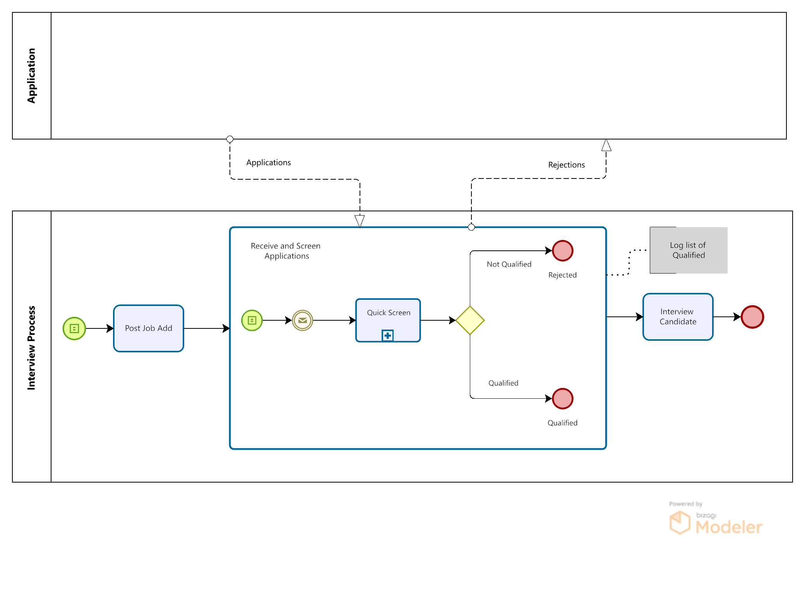

# Business Process Management Autumn Repeat 2022/2023 Paper MGMT06061

Time Allowed: 2 hours

Total Marks: 100

Answer any THREE questions.

## Question 1 (33.33 Marks)

Practicing Business Process Management requires the measurement and supervision of process performance. The three main processes are;

- Primary processes,
- Support processes, and
- Management processes.

Provide your understanding for EACH of the THREE processes

## Question 2 (33.33 Marks)

Draw the BPMN process model diagram for the Insurance Claim Handling Process described below.

Model the Claimant as a separate pool and show all the messages between the claimant and the process.

You do not need to show any intermediate or timer events in your model.

### Insurance claim handling

When a claim is received, we first check if the claimant has a valid insurance policy. If not, the claimant the claim is rejected and the claimant is informed. Otherwise, the severity of the claim is evaluated. Based on the outcome (simple or complex claims), relevant forms are sent to the claimant. Once the forms are returned, we check them for completeness. If the forms are complete, we register the claim in the Claims Management system and the evaluation of the claim may start. Otherwise, the claimant is asked to update the forms. Upon reception of the updated forms, we check them again and continue.

## Question 3 (33.33 Marks)

The BPMN diagram shown below describes the process for recruiting new applicants for a job.

Describe in your own words how the process works. Be sure to pay attention to the events, the gateways and the messages. Also be sure to describe the flow of the process

## Question 4 (Total 33.33 Marks)

### Question 4 a (13 Marks)

A process culture is a concept in which the business processes are known, agreed on, communicated and visible to all employees.

Describe FOUR characteristics of a process culture.

### Question 4 b (10 Marks)

A process owner is an individual or group of individuals with an ongoing responsibility and accountability for the successful design, development, execution and performance of a complete end-to-end business process.

Provide an overview of a process owner's scope of responsibility.

### Question 4 c (10 Marks)

In Business Process Management, what are the key responsibilities of the Process Project Manager?
