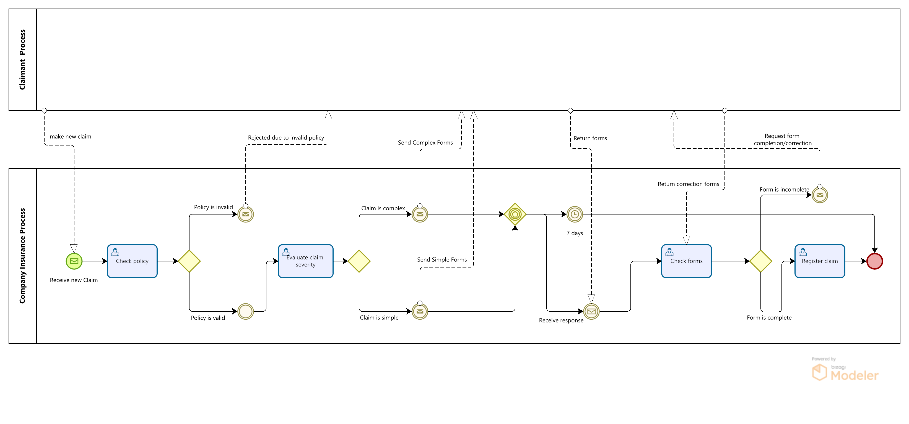
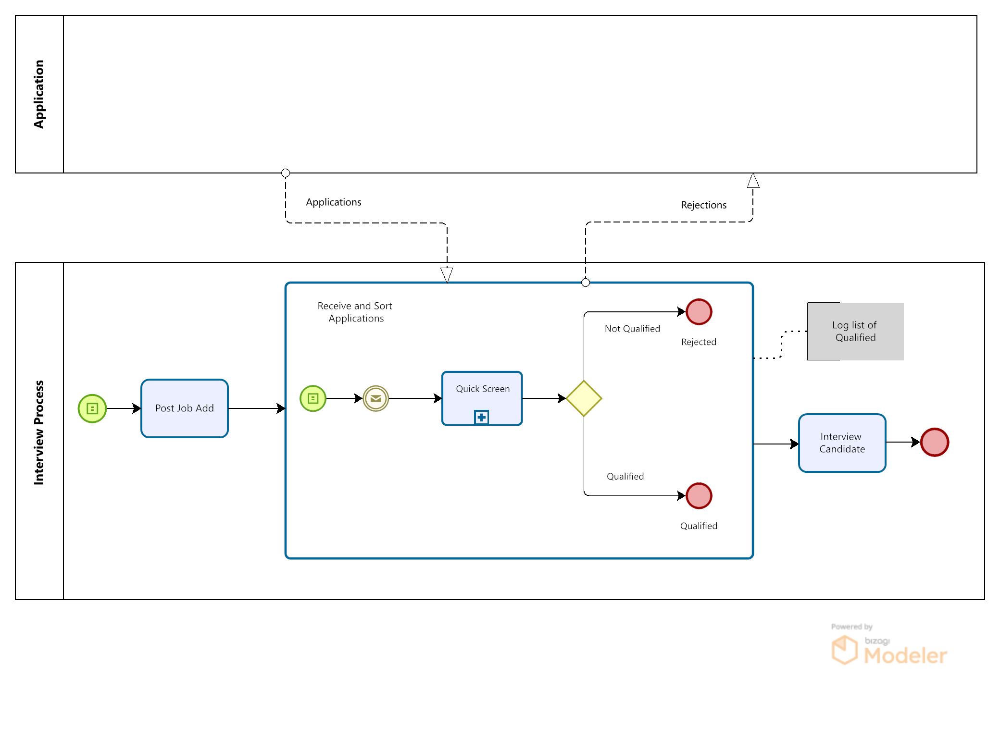

# Business Process Management Autumn Repeat 2022/2023 Paper MGMT06061

## Question 1 (33.33 Marks)

Practicing Business Process Management requires the measurement and supervision of process performance. The three main processes are;

- Primary processes,
- Support processes, and
- Management processes.

Provide your understanding for EACH of the THREE processes

### Answer 1

#### Understanding the Three Main Processes in Business Process Management

Practicing Business Process Management (BPM) necessitates a comprehensive understanding of various types of processes within an organization. These processes can be broadly categorized into three main types: Primary processes, Support processes, and Management processes. Each type plays a crucial role in ensuring the effective and efficient operation of an organization.

##### 1. Primary Processes

**Definition:**
Primary processes, also known as core or operational processes, are the fundamental activities that directly deliver value to the customer. They are the main processes through which an organization achieves its business objectives and meets customer needs.

**Characteristics:**

- **Customer-Focused:** These processes directly interact with and impact the customers. They produce the products or services that fulfill customer needs.
- **Value Chain:** They form the primary value chain of the organization, transforming inputs into outputs that are delivered to customers.
- **Revenue Generation:** Primary processes are typically revenue-generating activities, as they contribute directly to the financial performance of the organization.

**Examples:**

- Manufacturing and production processes in a factory.
- Order fulfillment processes in a retail company.
- Patient care processes in a healthcare facility.

**Importance in BPM:**

- **Optimization:** Enhancing primary processes can lead to significant improvements in efficiency, quality, and customer satisfaction.
- **Competitive Advantage:** Streamlined and well-managed primary processes can provide a competitive edge in the market by delivering superior value to customers.

##### 2. Support Processes

**Definition:**
Support processes, also known as enabling processes, are activities that provide essential support to the primary processes. They do not deliver direct value to the customer but are necessary for the primary processes to function effectively.

**Characteristics:**

- **Internal Focus:** These processes primarily serve internal stakeholders within the organization, ensuring that primary processes have the necessary resources and support.
- **Non-Revenue Generating:** Support processes typically do not generate revenue directly but are crucial for maintaining the operational infrastructure.
- **Facilitation:** They facilitate the smooth operation of primary processes by providing necessary resources, information, and services.

**Examples:**

- Human Resources (HR) processes, such as recruitment, training, and employee benefits management.
- IT support and maintenance processes.
- Financial management processes, including budgeting, accounting, and payroll.

**Importance in BPM:**

- **Efficiency:** Improving support processes can enhance the overall efficiency and effectiveness of the organization, reducing costs and minimizing disruptions.
- **Resource Allocation:** Effective management of support processes ensures that primary processes have the required support and resources to operate optimally.

##### 3. Management Processes

**Definition:**
Management processes are activities that oversee, control, and coordinate primary and support processes. They involve strategic planning, monitoring, and decision-making to ensure that organizational goals are met.

**Characteristics:**

- **Strategic Focus:** These processes involve high-level planning and control to align organizational activities with strategic objectives.
- **Decision-Making:** Management processes include activities such as setting goals, defining policies, and making decisions that affect the entire organization.
- **Performance Monitoring:** They involve measuring and analyzing performance metrics to ensure that both primary and support processes are achieving desired outcomes.

**Examples:**

- Strategic planning and goal-setting processes.
- Performance management and evaluation processes.
- Risk management and compliance processes.

**Importance in BPM:**

- **Alignment:** Effective management processes ensure that all activities within the organization are aligned with its strategic goals and objectives.
- **Control:** These processes provide the necessary oversight and control to maintain the quality and performance of primary and support processes.
- **Continuous Improvement:** Management processes play a key role in identifying areas for improvement and implementing changes to enhance organizational performance.

##### Conclusion

In summary, practicing Business Process Management requires a holistic understanding and effective management of primary, support, and management processes. Primary processes deliver direct value to customers, support processes provide essential services to enable primary processes, and management processes oversee and coordinate all activities to ensure strategic alignment and continuous improvement. By focusing on optimizing each of these process types, organizations can achieve greater efficiency, effectiveness, and competitiveness in the market.

## Question 2 (33.33 Marks)

Draw the BPMN process model diagram for the Insurance Claim Handling Process described below.

Model the Claimant as a separate pool and show all the messages between the claimant and the process.

You do not need to show any intermediate or timer events in your model.

### Insurance claim handling

When a claim is received, we first check if the claimant has a valid insurance policy. If not, the claimant the claim is rejected and the claimant is informed. Otherwise, the severity of the claim is evaluated. Based on the outcome (simple or complex claims), relevant forms are sent to the claimant. Once the forms are returned, we check them for completeness. If the forms are complete, we register the claim in the Claims Management system and the evaluation of the claim may start. Otherwise, the claimant is asked to update the forms. Upon reception of the updated forms, we check them again and continue.

### Question 2 Answer

1. **Create two pools**: one for the Claimant and one for the Insurance Company.
2. **Model the tasks and decision points** in the Insurance Company pool.
3. **Include message flows** between the Claimant and the Insurance Company for communication points.
4. **Show the sequence flows** within the Insurance Company pool to represent the process flow.

Here is a detailed outline of the process based on the provided description:

1. **Claim Submission**: The claimant submits the claim.
2. **Policy Validation**: The insurance company checks if the claimant has a valid policy.
   - If invalid, the claim is rejected and the claimant is informed.
   - If valid, proceed to evaluate the severity of the claim.
3. **Severity Evaluation**: The claim's severity is evaluated (simple or complex).
4. **Form Submission**: Relevant forms are sent to the claimant based on the claim's severity.
5. **Form Return**: The claimant returns the forms.
6. **Form Completeness Check**: The insurance company checks the forms for completeness.
   - If incomplete, the claimant is asked to update the forms.
   - If complete, register the claim and start evaluation.
7. **Claim Registration**: The claim is registered in the Claims Management system.
8. **Claim Evaluation**: The evaluation of the claim starts.

### BPMN Diagram Elements

- **Pools**: Claimant, Insurance Company
- **Lanes** (within the Insurance Company pool): Policy Validation, Severity Evaluation, Form Handling, Claim Registration
- **Tasks**: Submit Claim, Check Policy, Evaluate Severity, Send Forms, Return Forms, Check Completeness, Register Claim, Evaluate Claim
- **Message Flows**: Between Claimant and Insurance Company at points of communication
- **Sequence Flows**: Connecting tasks within the process

### BPMN Diagram

Conceptual layout of the BPMN diagram:

1. **Claimant Pool**:
   - Submit Claim
   - Return Forms
   - Update Forms (if necessary)

2. **Insurance Company Pool**:
   - **Policy Validation Lane**:
     - Check Policy
     - Inform Claimant of Rejection (if invalid)
   - **Severity Evaluation Lane**:
     - Evaluate Severity
     - Send Relevant Forms
   - **Form Handling Lane**:
     - Check Completeness
     - Ask for Form Update (if incomplete)
   - **Claim Registration Lane**:
     - Register Claim
     - Evaluate Claim

### BPMN Diagram Visual

Create the BPMN diagram:

1. **Pools**:
   - Claimant
   - Insurance Company
2. **Tasks** and **Decision Points** within the Insurance Company Pool:
   - Check Policy (with decision point for valid/invalid)
   - Evaluate Severity (simple/complex)
   - Send Forms (simple/complex forms)
   - Check Completeness (with decision point for complete/incomplete)
   - Register Claim
   - Evaluate Claim

3. **Message Flows** between Claimant and Insurance Company at:
   - Submit Claim
   - Inform Rejection
   - Send Relevant Forms
   - Return Forms
   - Ask for Form Update

### BPMN Diagram Answer

> [Bizagi Model File](images/business-process-2023-repeat-q2-answer.bpm)

## Question 3 (33.33 Marks)

The BPMN diagram shown below describes the process for recruiting new applicants for a job.

Describe in your own words how the process works. Be sure to pay attention to the events, the gateways and the messages. Also be sure to describe the flow of the process

[Bizagi Model File](images/business-process-2023-repeat-q3.bpm)

### Answer 3

Certainly! Here is the description of the recruitment process with the inclusion of a Conditional Start Event:

#### BPMN Diagram Process Description

1. **Conditional Start Event**:
   - The process begins with a **Conditional Start Event**, depicted as a circle with a diamond (or square) inside. This indicates that the recruitment process starts when a predefined condition is met (e.g., a job position becomes vacant or there is approval to hire).

2. **Post Job Ad**:
   - Once the condition is met, the first task is to post a job advertisement. This is indicated by a task box labeled "Post Job Add".

3. **Receive and Screen Applications**:
   - After the job ad is posted, applications are received. This is a subprocess labeled "Receive and Screen Applications".
   - Within this subprocess, two events occur in sequence: receiving the application (depicted as a document icon) and sending the application documents (depicted as an envelope icon) to the *Quick Screen* task.

4. **Quick Screen**:
   - Applications go through a "Quick Screen" process, where an initial evaluation of the applicant's qualifications is conducted.

5. **Gateway - Qualified or Not Qualified**:
   - After the quick screen, there is a decision point or gateway (depicted as a diamond shape) where applications are evaluated to determine if they are "Qualified" or "Not Qualified".

6. **Not Qualified - Rejected**:
   - If an applicant is determined to be "Not Qualified", they are rejected. This is shown by a flow leading to an end event labeled "Rejected" (depicted as a red circle).

7. **Qualified - Interview Candidate**:
   - If an applicant is deemed "Qualified", they proceed to the next step, which is to "Interview Candidate". This is shown by a task box labeled "Interview Candidate".
   - The qualified applications are also logged in a list of qualified candidates, indicated by a box labeled "Log list of Qualified".

8. **Interview Process**:
   - The candidate undergoes the interview process. This is the final step in this BPMN diagram.

9. **Application and Rejection Messages**:
   - Throughout this process, there are message flows indicating communication. Applications are submitted from an external pool labeled "Application", and rejection messages are sent back to this pool if the candidate is not qualified.

#### Summary

The recruitment process starts with a Conditional Start Event, meaning it begins when a specific condition is met. Once triggered, the job ad is posted, applications are received and screened, and a quick screen determines if applicants are qualified. Unqualified applicants are rejected, while qualified applicants proceed to an interview stage. Qualified candidates are logged for record-keeping, and the process includes communication flows for applications and rejections.

## Question 4 (Total 33.33 Marks)

### Question 4 a (13 Marks)

A process culture is a concept in which the business processes are known, agreed on, communicated and visible to all employees.

Describe FOUR characteristics of a process culture.

### Question 4 b (10 Marks)

A process owner is an individual or group of individuals with an ongoing responsibility and accountability for the successful design, development, execution and performance of a complete end-to-end business process.

Provide an overview of a process owner's scope of responsibility.

### Question 4 c (10 Marks)

In Business Process Management, what are the key responsibilities of the Process Project Manager?

#### Question 4a: Characteristics of a Process Culture

A process culture is vital for ensuring that business processes are well-understood, consistently applied, and continuously improved across an organization. Here are four key characteristics of a process culture:

1. **Transparency and Communication**:
   - **Description**: In a process culture, all business processes are clearly documented and made accessible to all employees. There is a high level of transparency regarding how processes work, who is responsible for them, and how they contribute to the organization's goals.
   - **Benefit**: This transparency ensures that everyone understands their role within the larger organizational framework and can perform their tasks more efficiently.

2. **Continuous Improvement**:
   - **Description**: There is a strong focus on continuously evaluating and improving business processes. Employees are encouraged to provide feedback and suggest improvements.
   - **Benefit**: This fosters an environment of innovation and adaptability, helping the organization to stay competitive and responsive to changes in the market.

3. **Alignment with Strategic Goals**:
   - **Description**: Business processes are designed and aligned with the strategic objectives of the organization. Every process is evaluated based on how it contributes to achieving these goals.
   - **Benefit**: Ensures that all activities within the organization are purposeful and contribute to the overall mission and vision, thereby improving efficiency and effectiveness.

4. **Empowerment and Accountability**:
   - **Description**: Employees are empowered to take ownership of processes and are held accountable for their performance. Roles and responsibilities are clearly defined, and individuals are given the authority to make decisions within their scope.
   - **Benefit**: This leads to higher levels of engagement and motivation among employees, as they feel responsible for the success of the processes they manage or participate in.

#### Question 4b: Process Owner's Scope of Responsibility

A process owner has a comprehensive scope of responsibility that spans across various aspects of business process management. Here is an overview:

1. **Design and Development**:
   - The process owner is responsible for the design and development of the business process. This includes defining the process flow, identifying necessary resources, and establishing performance metrics.

2. **Execution and Monitoring**:
   - Ensuring that the process is executed as designed and monitoring its performance is a critical responsibility. The process owner must track key performance indicators (KPIs) and ensure that the process is meeting its objectives.

3. **Improvement and Optimization**:
   - Continuously seeking ways to improve and optimize the process is a key part of the process owner's role. This involves analyzing performance data, identifying inefficiencies or bottlenecks, and implementing changes to enhance process effectiveness.

4. **Stakeholder Management**:
   - The process owner must manage relationships with all stakeholders involved in the process. This includes communicating process changes, gathering feedback, and ensuring that all stakeholders are aligned with the process goals.

5. **Compliance and Risk Management**:
   - Ensuring that the process complies with relevant regulations and standards is a crucial responsibility. The process owner must also identify and mitigate risks associated with the process.

6. **Training and Support**:
   - Providing training and support to employees involved in the process is essential. The process owner must ensure that all participants understand their roles and responsibilities and have the necessary skills and resources to perform their tasks effectively.

#### Question 4c: Key Responsibilities of the Process Project Manager

In Business Process Management, a Process Project Manager plays a critical role in overseeing the successful implementation and management of process improvement initiatives. Their key responsibilities include:

1. **Project Planning and Management**:
   - Developing detailed project plans, including scope, objectives, timelines, and resources. Managing project execution to ensure that deliverables are completed on time, within budget, and to the required quality standards.

2. **Stakeholder Communication**:
   - Ensuring effective communication with all project stakeholders, including process owners, team members, and senior management. This involves regular updates on project progress, risks, and issues.

3. **Resource Coordination**:
   - Allocating and managing resources, including personnel, technology, and budget. Ensuring that the project team has the necessary tools and support to complete their tasks.

4. **Risk Management**:
   - Identifying potential risks to the project and developing mitigation strategies. Monitoring risks throughout the project lifecycle and taking corrective actions as needed.

5. **Performance Monitoring and Reporting**:
   - Tracking project performance against defined metrics and milestones. Preparing and presenting regular progress reports to stakeholders, highlighting achievements, challenges, and next steps.

6. **Process Analysis and Improvement**:
   - Conducting detailed analyses of existing processes to identify areas for improvement. Leading efforts to redesign processes to enhance efficiency, reduce costs, and improve quality.

7. **Change Management**:
   - Managing the change process associated with implementing new or revised processes. This includes preparing the organization for change, communicating changes effectively, and ensuring a smooth transition.

8. **Quality Assurance**:
   - Ensuring that all process improvements meet the required quality standards. This involves conducting regular quality checks and audits to verify compliance with project goals and objectives.

In summary, a Process Project Manager is responsible for the successful delivery of process improvement projects, ensuring that they are completed on time, within budget, and achieve the desired outcomes. They play a key role in driving organizational efficiency and effectiveness through well-managed process initiatives.
